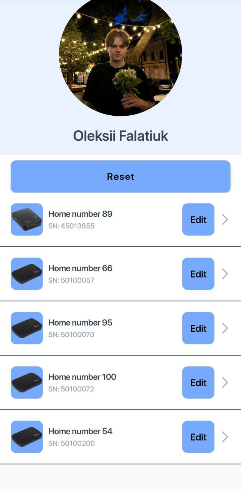
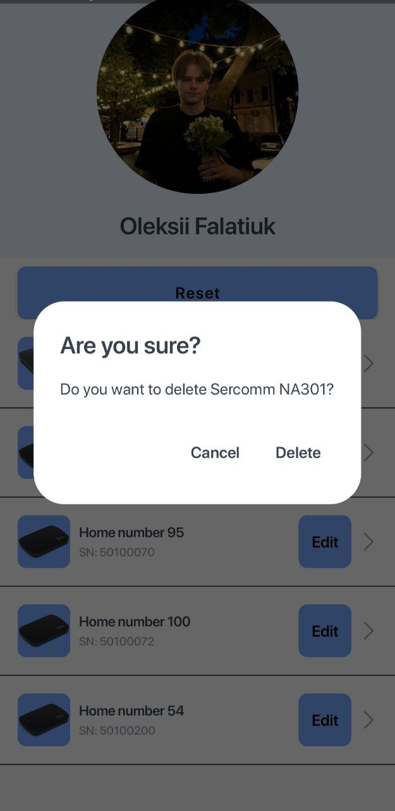
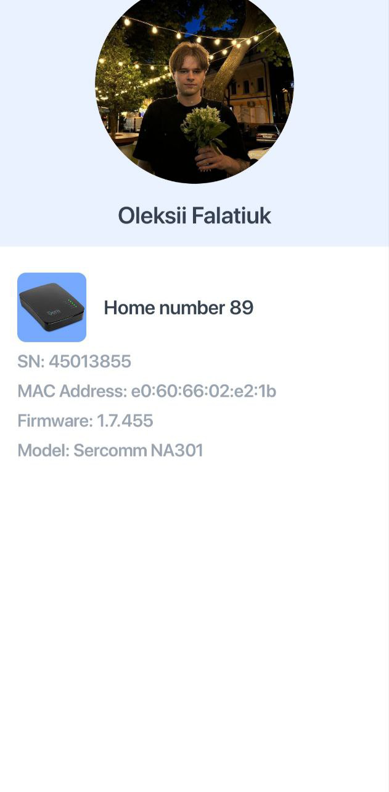
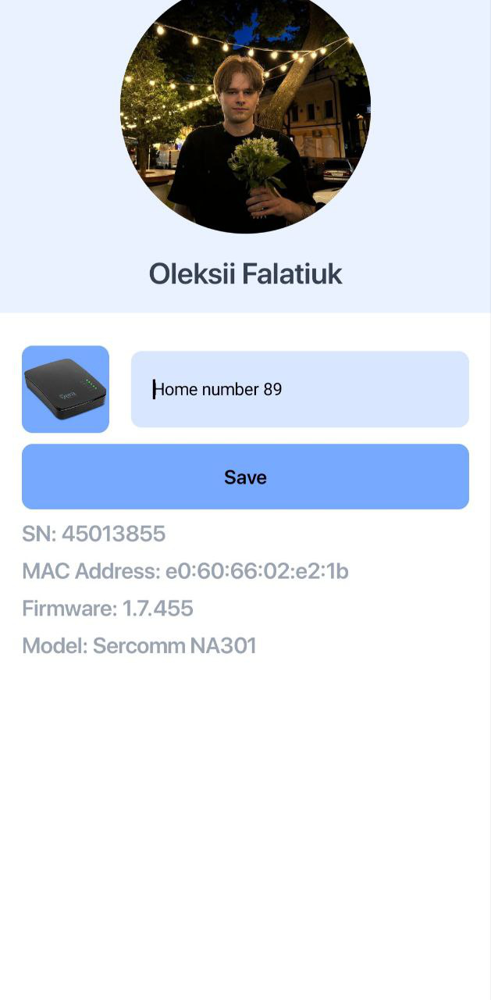

 

|                                            |                                            |                                           |
|:------------------------------------------:|:------------------------------------------:|:-----------------------------------------:|
|   |  |  |
|  |

Test Project - це тестовий застунок, його осоновна задача показати мої скіли :)
Дизайн був взятий з ТЗ

### Основний стек:

- Kotlin
- Jetpack Compose
- [Koin](https://github.com/InsertKoinIO/koin)
- Coroutines
- Retrofit2
- OkHttp3
- Room

#### Інше:
- Jetpack Compose Navigation
- Android Jetpack
- Splash Screen (https://developer.android.com/develop/ui/views/launch/splash-screen)

#### Архітектура:

- MVVM

### Back-end:
##### 1. Тестова  API
https://veramobile.mios.com/test_android/items.test

